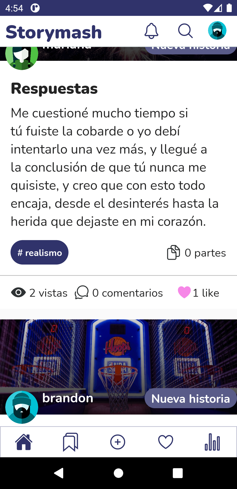

# StoryMash (NOT COMPLETED)

This is a basic social network app using Javascript Technologies like Nodejs, Mongodb, React, and so on.
This app can:

- Allows a user to do log in and look his profile and other users profile
- Allows a user to follow/unfollow to other user
- Allows a user to edit his profile (image / about)
- Allows a user create/read/update/delete a story
- Allows a user create/read/update/delete a continuation of his story
- Allows a user to add/remove favorites stories from their favorites
- Allows a user to create/read/update/delete story comments

## Installation:

Make sure you have Node, NPM and yarn installed.

```bash
git clone https://github.com/brandon-gs/storybox-app
cd storybox-app
yarn
```

### Starting the app:

Create an env file like the next

```
API_URL=http://SERVER_IP:SERVER_PORT/api/
API_SECRET=MY_CUSTOM_API_SECRET_FROM_API
```

You need download and run the API service from [this repo] (https://github.com/brandon-gs/storymash/)

```bash
# Run in dev mode:
yarn start
yarn android
```

## Technologies

- Typescript
- React
- Redux
- Jest

## Screenshots




